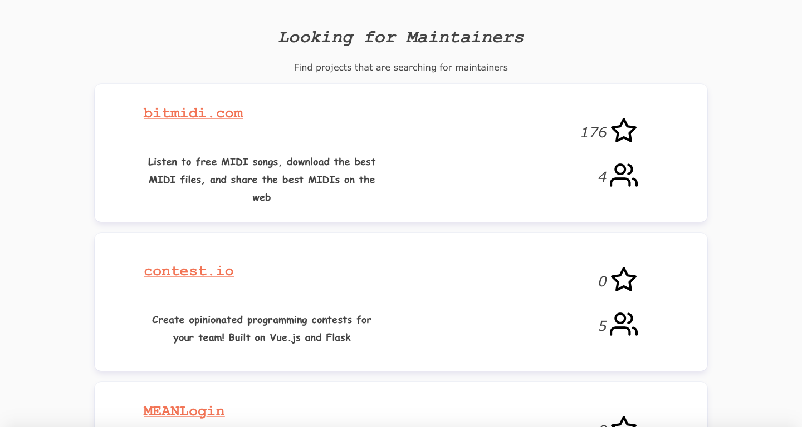

<<<<<<< HEAD
Maintainers Wanted
=======
Maintainers Wanted  
==================  
>>>>>>> 221d27a... Fixed spacing

  

# About #   

Following the tweet of [Sara Vieira](https://twitter.com/NikkitaFTW) (Is there no looking for maintainers website?), we decided that we would take matters into our own hands. She was replying to a tweet by [Nitin Tulswani](https://twitter.com/NTulswani), who was unable to further maintain his [React Performance Devtool](https://github.com/nitin42/react-perf-devtool), the largest React Perf Test Tool.    

"Maintainers Wanted" is a simple service to connect overworked project owners with eager devs who will continue to maintain larger projects. Instead of letting your project rot away, find someone who cares as much about it as you do, and who is willing to invest the time needed to keep it going.  

# Usage #  

Uploading a new project is quite simple: merely enter your username and repository _(Github Authentication coming soon)_ and the site will fill in the remaining information automatically!  

Users who browse the site will be presented with all projects currently up for grabs, completely with the amount of stars and contributors along with the name and description.  

Go ahead and try it yourself: [maintainerswanted.com](https://www.maintainerswanted.com)   
   
# Authors and License #   

License: MIT  
Felix Wu (flxwu)  
Quentin Oschatz (Qo2770)     

# Credits #   

=======
Feross Aboukhadijeh    
=======
[Feross Aboukhadijeh](twitter.com/feross) for always providing his help as well as sharing his ideas and opinions! ❤️🙏
