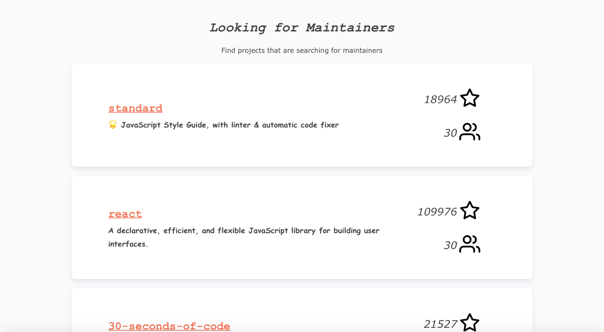
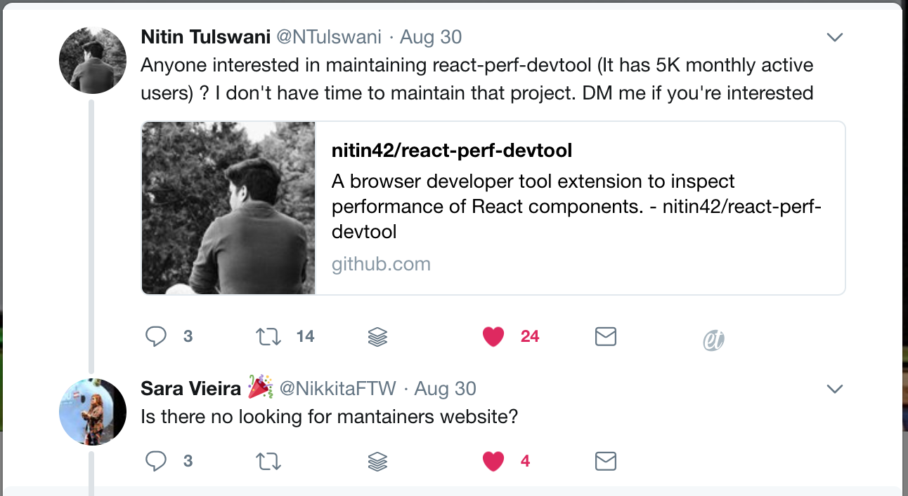

Maintainers Wanted  
==================  

  

# About #   


This project is inspired by [Sara Vieira](https://twitter.com/NikkitaFTW)'s reply to a tweet by [Nitin Tulswani](https://twitter.com/NTulswani), who was unable to further maintain his popular [React Performance Devtool](https://github.com/nitin42/react-perf-devtool). 

After reading the tweet, [@flxwu](twitter.com/flxwu) searched for a "Looking for Maintainers" platform but surprisingly didn't find any popular one. So he decided to take matter in own hands and create a platform on which Open Source Maintainers who are no longer able to maintain their projects can find other developers to hand their projects over. 

"Maintainers Wanted" is a simple service to connect overworked project owners with eager devs who will continue to maintain larger projects. Instead of letting your project rot away, find someone who cares as much about it as you do, and who is willing to invest the time needed to keep it going.

# Usage #  

Uploading a new project is quite simple: merely enter your username and repository _(Github Authentication coming soon)_ and the site will fill in the remaining information automatically!  

Users who browse the site will be presented with all projects currently up for grabs, completely with the amount of stars and contributors along with the name and description.  

Go ahead and try it yourself: [maintainerswanted.com](https://www.maintainerswanted.com)   
# Development #

Setup:
```
yarn install
cd client/ && yarn install
```

Run:
```
yarn dev
```

# Authors and License #   

License: MIT  
Felix Wu [@flxwu](twitter.com/flxwu)
Quentin Oschatz [@QuentinOschatz](twitter.com/QuentinOschatz)     

# Credits #   

[Feross Aboukhadijeh](https://www.twitter.com/feross) for always providing his help as well as sharing his ideas and opinions! ❤️🙏
